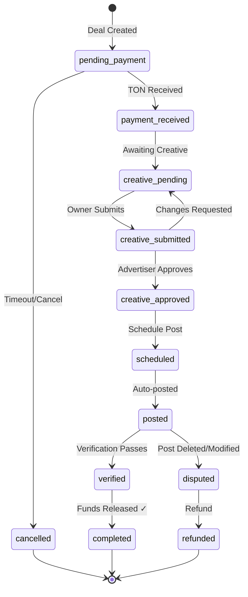

# Telegram Ads Marketplace 🚀

A complete Telegram Mini App for connecting channel owners with advertisers, featuring TON blockchain escrow payments and automated ad posting.


## 🌟 Features

### For Channel Owners
- 📢 Register and list your Telegram channels
- 💰 Set pricing for different ad formats (post, story, forward)
- 📊 Verified channel statistics from Telegram (via MTProto)
- 🤝 Receive and accept ad requests from advertisers
- 💸 Secure payments via TON escrow
- 📈 Subscriber growth tracking (30-day chart)

### For Advertisers
- 🔍 Browse verified channels with real statistics
- 📋 Create ad campaigns/requests
- ✅ Creative approval workflow
- 🔒 Funds held in escrow until delivery confirmed
- 📱 Auto-posting with verification

### Platform Features
- 🔐 Telegram WebApp authentication
- 💎 TON Connect wallet integration
- 🤖 Auto-posting via bot
- ✓ Post verification (not deleted/modified)
- ⏰ Auto-timeout for inactive deals
- 💬 In-deal messaging

## 🏗️ Architecture

```
┌─────────────────────────────────────────────────────────────┐
│                    Telegram                                  │
│  ┌─────────────┐  ┌─────────────┐  ┌─────────────┐         │
│  │  Telegram   │  │  Mini App   │  │  Channels   │         │
│  │    Bot      │  │   WebApp    │  │  (posting)  │         │
│  └──────┬──────┘  └──────┬──────┘  └──────▲──────┘         │
└─────────┼────────────────┼────────────────┼─────────────────┘
          │                │                │
          ▼                ▼                │
┌─────────────────────────────────────────────────────────────┐
│                    Firebase                                  │
│  ┌─────────────┐  ┌─────────────┐  ┌─────────────┐         │
│  │   Cloud     │  │  Firestore  │  │   Hosting   │         │
│  │  Functions  │◄─┤     DB      │  │  (webapp)   │         │
│  └──────┬──────┘  └─────────────┘  └─────────────┘         │
└─────────┼───────────────────────────────────────────────────┘
          │
          ▼
┌─────────────────────────────────────────────────────────────┐
│                 TON Blockchain                               │
│  ┌─────────────┐  ┌─────────────┐                          │
│  │  Hot Wallet │  │ Deal Wallets│                          │
│  │  (platform) │  │  (escrow)   │                          │
│  └─────────────┘  └─────────────┘                          │
└─────────────────────────────────────────────────────────────┘
```

## 📁 Project Structure

```
telegram-ads-marketplace/
├── functions/              # Firebase Cloud Functions (Backend)
│   ├── src/
│   │   ├── api/           # REST API handlers
│   │   │   ├── users.ts   # User authentication & profile
│   │   │   ├── channels.ts # Channel management
│   │   │   ├── requests.ts # Ad requests/campaigns
│   │   │   └── deals.ts   # Deal lifecycle
│   │   ├── bot/           # Telegram bot handler
│   │   ├── services/      # Core services
│   │   │   ├── telegram.ts # Telegram Bot API wrapper
│   │   │   ├── userbot.ts  # MTProto stats via GramJS
│   │   │   ├── ton.ts     # TON wallet operations
│   │   │   └── scheduler.ts # Scheduled tasks
│   │   ├── config.ts      # Configuration
│   │   ├── types.ts       # TypeScript types
│   │   ├── firebase.ts    # Firebase initialization
│   │   └── index.ts       # Function exports
│   └── package.json
├── webapp/                 # React Mini App (Frontend)
│   ├── src/
│   │   ├── pages/         # Page components
│   │   ├── components/    # Reusable UI components
│   │   ├── contexts/      # React contexts
│   │   ├── lib/           # Utilities & API client
│   │   └── styles/        # CSS styles
│   ├── index.html
│   └── package.json
├── firebase.json          # Firebase configuration
├── firestore.rules        # Security rules
└── README.md
```

## 🚀 Getting Started

### Prerequisites

- Node.js 18+
- Firebase CLI (`npm install -g firebase-tools`)
- A Firebase project
- Telegram Bot Token

### Installation

1. **Clone the repository**
   ```bash
   git clone https://github.com/your-username/telegram-ads-marketplace.git
   cd telegram-ads-marketplace
   ```

2. **Install dependencies**
   ```bash
   npm install
   cd functions && npm install && cd ..
   cd webapp && npm install && cd ..
   ```

3. **Configure Firebase**
   ```bash
   firebase login
   firebase use --add your-project-id
   ```

4. **Set up environment variables**
   ```bash
   cd functions
   cp .env.example .env
   # Edit .env with your values
   ```

5. **Set Firebase config**
   ```bash
   firebase functions:config:set \
     telegram.bot_token="YOUR_BOT_TOKEN" \
     ton.api_key="YOUR_TON_API_KEY"
   ```

### Development

1. **Start Firebase emulators**
   ```bash
   npm run emulators
   ```

2. **Start webapp dev server**
   ```bash
   cd webapp
   npm run dev
   ```

3. **Set webhook for bot (local development with ngrok)**
   ```bash
   ngrok http 5001
   # Then set webhook URL
   curl "https://api.telegram.org/bot<TOKEN>/setWebhook?url=<NGROK_URL>/webhook"
   ```

### Deployment

1. **Build webapp**
   ```bash
   cd webapp
   npm run build
   ```

2. **Deploy to Firebase**
   ```bash
   npm run deploy
   ```

3. **Set production webhook**
   ```bash
   curl "https://api.telegram.org/bot<TOKEN>/setWebhook?url=https://<PROJECT>.cloudfunctions.net/telegramWebhook"
   ```

## 💰 Deal Flow



## 🔐 Security

- **Telegram WebApp Authentication**: All API requests are verified using Telegram's init data hash
- **Firestore Rules**: Strict access control for all collections
- **Escrow**: Funds held in separate deal wallets until verification
- **Admin Verification**: Channel admin status is re-verified on financial operations

## 🛠️ Tech Stack

| Component | Technology |
|-----------|------------|
| Frontend | React 18, Vite, TypeScript |
| Styling | Custom CSS, Telegram UI guidelines |
| Backend | Firebase Cloud Functions, Node.js |
| Database | Firebase Firestore |
| Bot Framework | Telegraf.js |
| MTProto Stats | GramJS (telegram) |
| Payments | TON SDK (tonweb), TON Connect |
| Hosting | Firebase Hosting |

## 📊 API Endpoints

| Endpoint | Method | Description |
|----------|--------|-------------|
| `/api/users/me` | GET/PUT | User profile |
| `/api/channels` | GET/POST | List/register channels |
| `/api/channels/:id` | GET/PUT | Channel details |
| `/api/requests` | GET/POST | Ad requests |
| `/api/requests/:id/apply` | POST | Apply to request |
| `/api/deals` | GET/POST | List/create deals |
| `/api/deals/:id/status` | PUT | Update deal status |
| `/api/deals/:id/messages` | GET/POST | Deal messages |

## ⚠️ Known Limitations (MVP)

1. **Premium / Language Stats**: Telegram's `stats.GetBroadcastStats` API requires channels with **500+ subscribers**. Smaller channels will display ERR (views-to-subscribers ratio) instead.
2. **Media**: Currently supports text + single image. Multiple media planned for future.
4. **Disputes**: Require manual admin intervention.
5. **Growth Chart**: Begins collecting data from first channel view. Chart appears after 2+ data points.

## 🔮 Future Enhancements

- [x] Full channel analytics via MTProto
- [x] Subscriber growth tracking
- [x] Category-based discovery with filters
- [x] Push notifications
- [x] Analytics dashboard
- [ ] Multiple media support (carousel, video)
- [ ] Smart contract-based escrow
- [ ] Rating and review system

- [ ] Bulk deal management

## 📝 AI Code Disclosure

Approximately **70%** of this codebase was generated by AI , with human review and adjustments for architecture decisions and business logic.

## 📄 License

MIT License - see [LICENSE](LICENSE) file.

## 🤝 Contributing

Contributions are welcome! Please read our [Contributing Guide](CONTRIBUTING.md) for details.

---

Built with ❤️ for the Telegram ecosystem
